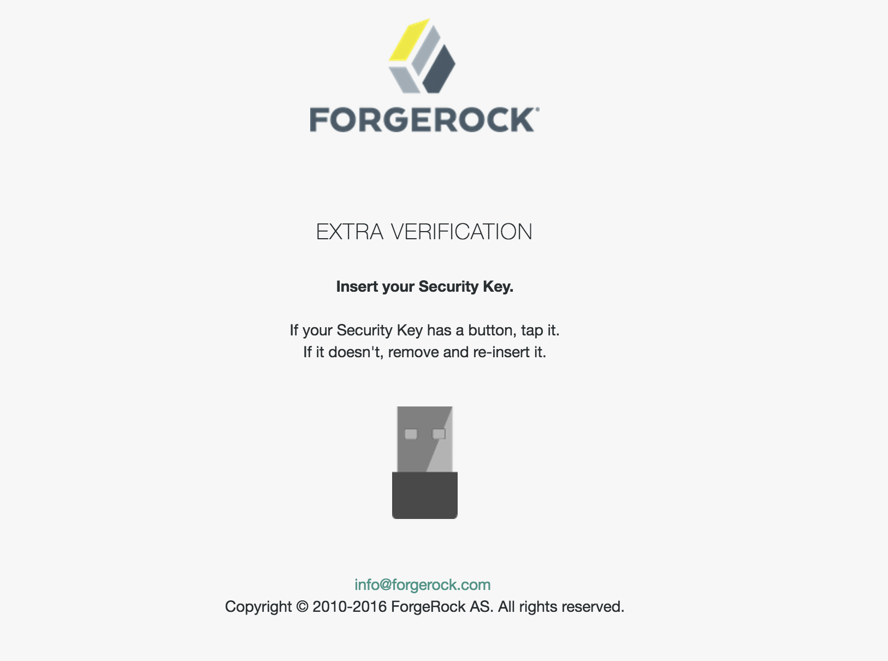

# ForgeRock OpenAM FIDO U2F Authentication Module

This is a FIDO U2F authentication module for ForgeRock OpenAM.

This module allows you to use the FIDO U2F protocol on ForgeRock OpenAM.
It attempts to provide a full implementation of a FIDO U2F server for ForgeRock OpenAM.

The following features are supported:

* Registration of U2F devices. Multiple devices per user.
* Signing in using any registered U2F device.
* Simple device management.
* Whitelisting device types.

For storing device registration data, any OpenAM identity store can be used (OpenDJ, SQL, LDAP, etc.). However, by default the "Memory data store" is enabled. This is a special data store that allows testing this module without touching your identity store. Ideal for demo and POC scenarios.   



## What is FIDO U2F? 
> 
"The FIDO U2F protocol enables relying parties to offer a strong cryptographic 2nd factor option for end user security. The relying party's dependence on passwords is reduced. The password can even be simplified to a 4 digit PIN. End users carry a single U2F device which works with any relying party supporting the protocol. The user gets the convenience of a single 'keychain' device and convenient security."
[fidoalliance.org](https://fidoalliance.org "")

## What is ForgeRock OpenAM?
> 
"ForgeRock OpenAM provides core identity services to simplify the implementation of transparent single sign-on (SSO) as a security component in a network infrastructure. OpenAM provides the foundation for integrating diverse web applications that might typically operate against a disparate set of identity repositories and are hosted on a variety of platforms such as web and application servers."
[forgerock.org](https://forgerock.org "")

## Why this module?

Out of the box, ForgeRock OpenAM supports a lot of authentication standards. However, FIDO U2F was not yet supported.

## How to install it

1.  Ensure you can access OpenAM over HTTPS. Without HTTPS, FIDO U2F cannot work.
  
  Moreover, make sure the XUI interface is enabled.
2.  Download the source with Git.
3.  Build the module with Maven.
  
  ```
  mvn clean package
  ```
  
4.  Copy the resulting jar file named *openam-u2f-[VERSION].jar* from the directory *target*, as well as all its dependencies found in the directory *target/dependencies*, to the  directory *WEB-INF/lib* of your OpenAM installation.
5.   Install the module using the [OpenAM tools](https://backstage.forgerock.com/#!/docs/openam/12.0.0/install-guide/chap-install-tools "OpenAM tools").
  
  ```
  ssoadm create-svc -u amadmin -f /location/of/your/password --xmlfile 'src/main/resources/amAuthU2F.xml'
  ```
  
  ```
  ssoadm register-auth-module -u amadmin -f /location/of/your/password --authmodule nl.arietimmerman.openam.u2f.U2F
  ```
  
6. Optionally, copy the template files from the `theme` folder to `/location/of/openam_webapps/`
7. Restart OpenAM.
8. Configure the module. At a minimum, configure an *App Id*. Make sure you use a HTTPS-url as the *App Id*.	

## How to prepare OpenDJ for storing device data

In order to use OpenDJ - or any other LDAPv3 Directory - simply import the *ldif* file found in the directory *example*.
After that, configure the module to use the OpenAM Identity Store for storing device data.
Also, do not forget to configure the identity store in OpenAM to accept the attribute *u2fdevices*.

## Known issues

Currently, there are some issues known.

*   ForgeRock OpenAM renders a *ChoiceCallback* element as radio buttons. Even when it is configured to allow multiple selections. Hence, it is not possible to select multiple options. This functionality is used in the device listing.
*   The module requires that the XUI interface is enabled because of the usage of *ScriptTextOutputCallback* elements.
